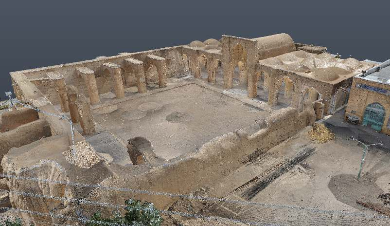
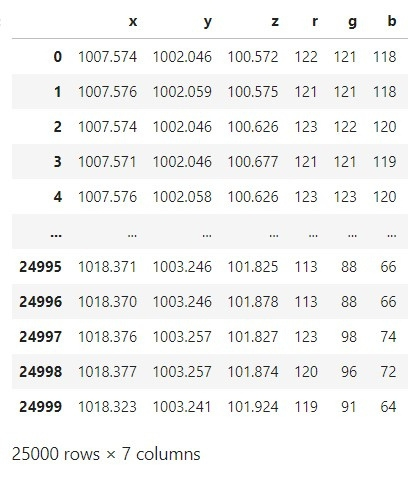

<div align="center">
  <p>
    <a align="center" href="" target="_blank">
      
    </a>
  </p>
  <br>

  <div align="center">
      <a href="https://github.com/tekboart/">
          
      </a>&nbsp;&nbsp;&nbsp;
      <a href="https://www.linkedin.com/in/kyan-bhr/">
          
      </a>&nbsp;&nbsp;&nbsp;
      <a href="https://scholar.google.com/citations?user=r3xmjQUAAAAJ&hl=en">
          
      </a>&nbsp;&nbsp;&nbsp;
      <a href="https://www.kaggle.com/tekboart">
          
      </a>&nbsp;&nbsp;&nbsp;
  </div>
</div>

<hr height="10">

# Social Network Analysis (SNA) & Graph ML to Detect Objects in Point Cloud Data using Community Detection


This repository contains the code (and a sample of data) of a research project at the intersection of SNA, Graph ML, and the built environment. This research encompasses several steps:
1. Importing point cloud data into python.
1. Converting point cloud data to the corresponding Adjacency matrix.
1. Creating an undirected Graph network (using igraph).
1. Analyze the created Graph using different metrics (e.g., centrality measures).
1. Conduct community detection (CD) on the graph using different methods (i.e., Label Propagation, Eigenvector, Infomap, and Components).
1. Visualize and compare the results (of different CD methods)

## Requirements


<!-- - Please refer to the file `requirements.txt` for a comprehesive list of packages and their corresponding version. -->

## Project Dir Structure
```bash
.
├── data
│   ├── 101000 points
│   ├── 164000 points
│   ├── 244000 points
│   ├── 61700 points
│   ├── 68400 points
│   └── 99000 points
├── images
│   └── logos
├── outputs
│   ├── Graph Visualization
│   └── Stats
└── utils

13 directories

```

## Data
Pointcloud data is a csv file with "space" separator, containg six/6 features (See Table [[1]](#1)).

<p align="center">
    <p align="center" style="font-size:90%;"><b>Table <a id="1">[1]</a> :</b> A sample of our input CSV data</p>
    <p align="center"></p>
</p>

## Contact
<!-- Unfortunately this repo is no longer actively maintained.  -->
If you have any questions, feel free to contact TekBoArt @tekboart.

## License
<!-- Creative Common Licenses -->
<!-- "Creative Commons Attribution-NonCommercial-ShareAlike (CC-BY-NC-SA)" -->
Shield: [![CC BY-NC-SA 4.0][cc-by-nc-sa-shield]][cc-by-nc-sa]

<!-- MIT License (can be used commercially) -->
<!-- Shield: [](https://opensource.org/licenses/MIT) -->

- Refer to the file `LICENSE` for more information regarding the license of this repository.

This work is licensed under a
[Creative Commons Attribution-NonCommercial-ShareAlike 4.0 International License][cc-by-nc-sa].

[![CC BY-NC-SA 4.0][cc-by-nc-sa-image]][cc-by-nc-sa]

[cc-by-nc-sa]: http://creativecommons.org/licenses/by-nc-sa/4.0/
[cc-by-nc-sa-image]: https://licensebuttons.net/l/by-nc-sa/4.0/88x31.png
[cc-by-nc-sa-shield]: https://img.shields.io/badge/License-CC%20BY--NC--SA%204.0-lightgrey.svg


